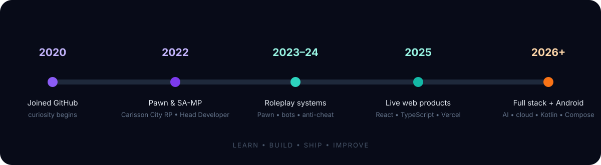

<div align="center">
  
</div>

<div align="center">
  <a href="https://github.com/SowjOcaya?tab=followers"></a>
  <a href="https://github.com/SowjOcaya?tab=repositories"></a>
  
</div>

<br/>

> ### `SowjOcaya / README.md`
>
> Full-stack, Android, and SA-MP developer from the Philippines. I turn ideas into shipped products—roleplay systems, anti-cheat infrastructure, web platforms, native Android utilities, AI experiences, APIs, and bots.

<div align="center">
  
</div>

## SA-MP engineering chapter

<table>
  <tr>
    <td width="36%" align="center" valign="middle">
      
      <br/><br/>
      
    </td>
    <td width="64%" valign="top">
      <h3>Carisson City Roleplay</h3>
      <p><b>Head Developer, 2022–2024</b> — led development for the GTA: San Andreas Multiplayer roleplay server owned by <b>Shasha Cortez</b>. Worked on Pawn gamemode systems, server features, gameplay logic, administration tooling, maintenance, debugging, and anti-cheat development throughout the project's run.</p>
    </td>
  </tr>
</table>

### Soj AI Anti-Cheat

A production-oriented, AI-assisted anti-cheat architecture for **open.mp / SA-MP roleplay servers**. Pawn remains authoritative for detection, while AI evaluates evidence, produces confidence scores and replay-style summaries, and gives administrators recommendations—the model does not blindly ban players.

- Deterministic Pawn/server-side checks before AI analysis
- Movement and teleport anomaly reporting with latency-aware confidence reduction
- NVIDIA NIM using an OpenAI-compatible LLM interface
- Secure multi-server ingestion with separate secrets and shared-secret authentication
- Next.js/Tailwind administration dashboard with REST APIs and live Socket.IO updates
- PostgreSQL/Supabase persistence, Discord alerts, JWT authentication, validation, rate limiting, and configurable enforcement thresholds

> The implementation is kept private, so this profile describes the architecture without publishing protected server code or credentials.

## Live developer dashboard

<!-- Generated daily by lowlighter/metrics. The fallback cards below remain visible until the first workflow run completes. -->

<div align="center">
  
</div>

## Stack at a glance

<div align="center">
  
  <br/><br/>
  
</div>

<details>
<summary><b>What the icons represent</b></summary>
<br/>

| Domain | Technologies and capabilities |
|:--|:--|
| **SA-MP / open.mp** | Pawn, roleplay gamemodes, gameplay and administration systems, server maintenance, HTTP integration, deterministic detection, AI-assisted anti-cheat architecture |
| **Android** | Kotlin, Jetpack Compose, Material 3, Room, Hilt, Coroutines, WorkManager, DataStore, Coil, AIDL, Shizuku, Gradle, JUnit |
| **Frontend** | React, Next.js, TypeScript, JavaScript, Vite, Tailwind CSS, Framer Motion, Radix UI, responsive interfaces |
| **Backend & data** | Next.js API routes, Node.js, PHP, MongoDB/Mongoose, Supabase, Firebase, PL/pgSQL, REST APIs |
| **AI & automation** | OpenAI-compatible APIs, Google GenAI, GitHub/Octokit, bots, document processing, workflow automation |
| **Delivery** | Git, GitHub Actions, Vercel, ESLint, type checking, testing, release builds, ProGuard/R8 |

</details>

## Contribution pulse

<div align="center">
  
  
</div>

<div align="center">
  
</div>

## Build timeline

<div align="center">
  
</div>

## Current direction

```text
FOUNDATION Pawn • SA-MP roleplay engineering • game-server systems • anti-cheat development
NOW        Native Android products • full-stack platforms • AI-powered experiences
NEXT      CI/CD • observability • secure scalable APIs • stronger automated testing
MISSION   Build useful software for real people and contribute reusable work to open source
```

<div align="center">
  <a href="https://github.com/SowjOcaya?tab=repositories"></a>
  <a href="https://greymeng.vercel.app"></a>
</div>

<br/>

<div align="center">
  <sub>Live metrics update automatically through GitHub Actions. Private repository names and source details are never displayed.</sub>
</div>
